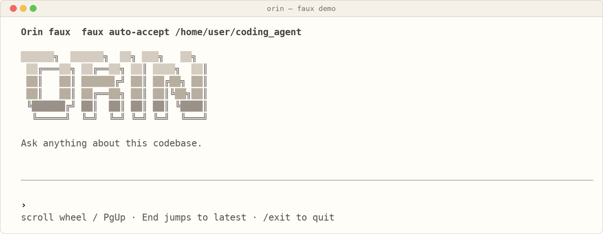
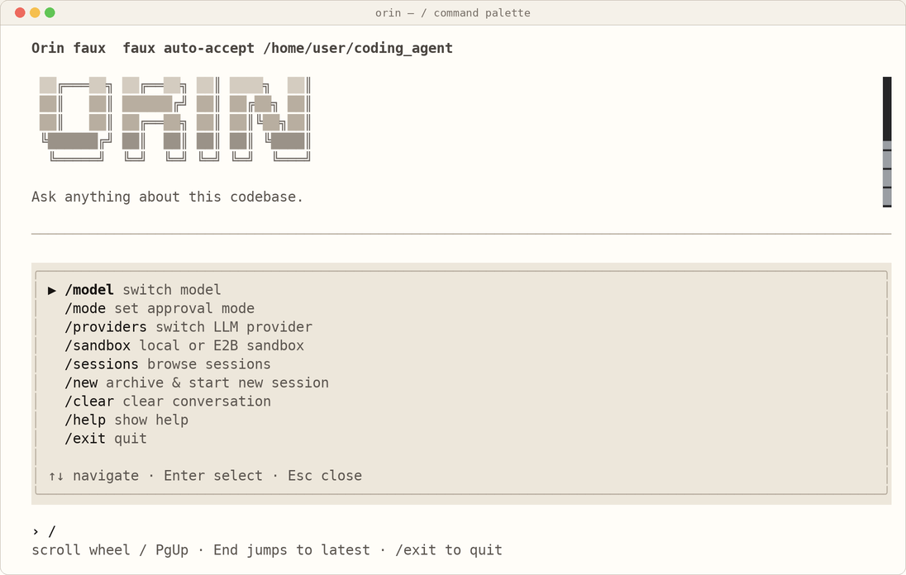
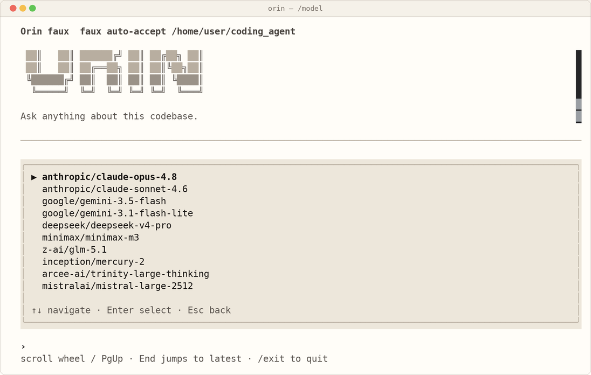
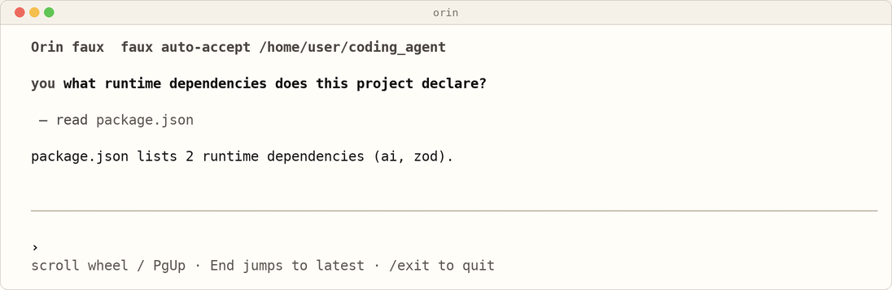

# Orin

**A terminal coding agent CLI.** Give it a prompt and Orin autonomously reads,
searches, edits, and runs code in your working directory — calling tools in a
loop, streaming its work to an interactive TUI, and pausing for your approval
before anything dangerous.

Orin is built on [Bun](https://bun.sh), the [Vercel AI SDK](https://sdk.vercel.ai),
and a [SolidJS](https://www.solidjs.com)-powered terminal UI
([`@opentui/solid`](https://github.com/anomalyco/opentui)). The design and phased
build plan live in [`SPEC.md`](./SPEC.md).

<p align="center">
  
  <br>
  <em>The interactive TUI, shown in offline <code>--faux</code> demo mode.</em>
</p>

---

## Features

- **Agentic loop** — streams an assistant turn, executes any tool calls it
  produces, feeds the results back, and repeats until the task is done.
- **A focused tool set** — `read`, `write`, `edit`, `bash`, `grep`, `find`,
  `ls`, and `delegate_read`. The `edit` tool applies exact-match replacements
  with a fuzzy fallback chain and renders unified diffs.
- **Approval gate** — three modes you can switch on the fly: `normal` (ask
  before writes/commands), `allow all` (auto-accept), and `plan` (read-only —
  blocks `write`/`edit`/`bash`).
- **Interactive TUI** — streaming markdown, live diffs, a slash-command palette,
  and a session browser.
- **Pluggable LLM providers** — a provider registry behind a single interface.
  OpenRouter and Regolo AI (EU-hosted, OpenAI-compatible) ship today; the
  interface anticipates Anthropic, OpenAI, LiteLLM, and gateway backends. Switch
  at runtime with `/providers`, or store keys with `/providers configure`.
- **Two model tiers** — a capable **main** model for reasoning and a cheap model
  for offloaded work. The `delegate_read` tool hands read-heavy tasks (scan a
  big file, summarize logs) to the cheap model so the bulk never enters the main
  context.
- **Role-bound subagent routing** — `task` subagents pick a model by preset:
  `explore` runs on the **cheap** model (read-only investigation), `implement` on
  a **code-tuned** model (Kimi K2.7 Code by default), and `review` on **main**.
  Override per role with `models.roles.<preset>` in `~/.orin/config.json`; an id
  the active provider doesn't support falls back to the tier default.
- **Subagent isolation** — `task` subagents default to `shared` (edit the local
  working tree, changes persist), with `worktree` (run on a fresh git branch,
  isolated but persistent — the summary reports the branch + diff) and `sandbox`
  (ephemeral E2B clone, for untrusted code) as opt-ins. Set the floor with
  `/settings isolation <mode>` (persisted to `subagent.isolation` in
  `~/.orin/config.json`, or `ORIN_SUBAGENT_ISOLATION`); it's a guarantee — the
  agent may escalate to a more-isolated mode per task but never weaken below it.
- **Context compaction** — old turns are summarized and stale tool output evicted
  automatically as the context window fills.
- **Persistent sessions** — every session is an append-only JSONL log under
  `~/.orin/sessions/`. Browse and resume them with `/sessions` or `--resume`.
- **Local or remote execution** — run tools on your machine or in an
  [E2B](https://e2b.dev) cloud sandbox by setting `sandbox.active` to `"e2b"` in
  `~/.orin/config.json` (requires `E2B_API_KEY`).
- **Lifecycle hooks** — `before_tool` / `after_tool` / `before_prompt` /
  `before_compact` / `session_start` / `session_end` interception points (used,
  for example, to transparently route `bash` through [RTK](https://github.com/rtk-ai/rtk)
  for command-output compression when it is installed).
- **Offline demo** — `orin --faux` runs the full TUI with scripted responses and
  no API key.

## Requirements

- **[Bun](https://bun.sh) ≥ 1.1** — required, not just Node. Orin's TUI relies on
  Bun's FFI and a Bun preload transform; running it under plain `node` will not
  work. (Node ≥ 20 is listed for tooling compatibility, but the agent runs on Bun.)
- A terminal emulator with a real TTY (the TUI cannot be piped).
- An **[OpenRouter](https://openrouter.ai/keys) API key** for real agent use
  (not needed for `--faux`).

## Quick start

```bash
git clone https://github.com/thetombrider/coding_agent.git
cd coding_agent
./install.sh        # installs Bun if needed, installs deps, builds, links `orin`
orin                # start the interactive agent
```

`install.sh` is safe to re-run. It seeds `~/.orin/config.json` with defaults. Configure
API keys in the TUI with `/providers configure` (OpenRouter) and `/settings e2b`
(E2B — only needed for `sandbox` subagent isolation; `task` works without it on
`shared`/`worktree`). If Bun isn't on your `PATH` yet, the script prints the line to add.

Prefer to run from source without a global install:

```bash
bun install
bun run start       # === bun src/cli.ts
```

Try it with no API key:

```bash
orin --faux         # fully offline, scripted demo
```

## Configuration

Configuration is resolved from **defaults → `~/.orin/config.json` → environment
variables** (env vars win, so CI/CD works without editing the file). Copy
[`.env.example`](./.env.example) to `.env` to get started, or edit the config
file directly.

| Setting | Env var | Notes |
| --- | --- | --- |
| OpenRouter API key | `OPENROUTER_API_KEY` | Required for the default backend. Also `provider.openrouter.apiKey` in config. |
| Regolo API key | `REGOLO_API_KEY` | Optional EU-hosted backend (`/providers regolo`). Also `provider.regolo.apiKey` in config. |
| Main model | `ORIN_MODEL` | Default agent model (OpenRouter `provider/model` id). |
| Cheap model | `ORIN_CHEAP_MODEL` | Used by `delegate_read` and compaction. |
| Approval mode | `ORIN_APPROVAL_MODE` | `normal` \| `auto-accept` \| `plan`. |
| Subagent isolation | `ORIN_SUBAGENT_ISOLATION` | `shared` \| `worktree` \| `sandbox` floor for `task` subagents (`subagent.isolation` in config; `/settings isolation`). |
| E2B API key | `E2B_API_KEY` | Optional — for whole-session E2B (`sandbox.active: "e2b"`) or `sandbox` subagent isolation. Also `sandbox.e2b.apiKey` in config. |

Your config, sessions, and keys all live under `~/.orin/` and are untouched by
upgrades.

### Telemetry

Orin records per-call **cost and token metrics** (turn cost, tool durations, a
session summary) locally. They append as JSON lines to `~/.orin/metrics.jsonl`
and are mirrored into the session log. This is on by default and never leaves
your machine.

| Setting | Env var | Notes |
| --- | --- | --- |
| Disable local metrics | `ORIN_NO_TELEMETRY=1` | Suppresses the JSONL/stdout sinks. Also `telemetry.enabled: false` in config. |
| Echo metrics to stdout | `ORIN_TELEMETRY_STDOUT=1` | Prints each metric event (debugging). |
| Metrics file path | — | `telemetry.metricsFile` in config (default `~/.orin/metrics.jsonl`). |

#### OpenTelemetry trace export (OTLP)

Orin can also export **OTLP traces** following the OpenTelemetry
[GenAI semantic conventions](https://opentelemetry.io/docs/specs/semconv/gen-ai/),
so a session shows up in **Langfuse, Arize Phoenix, Grafana Tempo, Jaeger, or any
OTLP/HTTP backend** as a trace: a session root span with child **LLM generation
spans** (model, token usage, cost) and **tool spans** (duration, ok/error).

It is **off by default** and the OpenTelemetry SDK is **lazy-loaded only when an
endpoint is configured** — there's no startup or bundle cost when off.
`ORIN_NO_TELEMETRY` does *not* affect OTLP export; it has its own switch.

Enable it by setting an endpoint, either via the standard `OTEL_*` env vars
(which win over the config file) or under `telemetry.otel` in
`~/.orin/config.json`:

| Setting | Env var | Notes |
| --- | --- | --- |
| Traces endpoint | `OTEL_EXPORTER_OTLP_ENDPOINT` | Base URL; `/v1/traces` is appended if missing. Setting it auto-enables export. Also `telemetry.otel.endpoint`. |
| Traces endpoint (exact) | `OTEL_EXPORTER_OTLP_TRACES_ENDPOINT` | Full traces URL, used verbatim (wins over the base endpoint). |
| Headers | `OTEL_EXPORTER_OTLP_HEADERS` | `key=value,key2=value2` — e.g. an `Authorization` token. Also `telemetry.otel.headers`. |
| Protocol | `OTEL_EXPORTER_OTLP_PROTOCOL` | Default `http/protobuf`. Also `telemetry.otel.protocol`. |
| Service name | `OTEL_SERVICE_NAME` | Resource `service.name` (default `orin`). Also `telemetry.otel.serviceName`. |
| Sample ratio | `OTEL_TRACES_SAMPLER` / `OTEL_TRACES_SAMPLER_ARG` | e.g. `traceidratio` + `0.25`. Also `telemetry.otel.sampleRatio`. |

Example — export to Langfuse via env vars:

```bash
export OTEL_EXPORTER_OTLP_ENDPOINT="https://cloud.langfuse.com/api/public/otel"
export OTEL_EXPORTER_OTLP_HEADERS="Authorization=Basic <base64 pk:sk>"
orin "summarise src/agent/loop.ts"
```

Or in `~/.orin/config.json`:

```jsonc
{
  "telemetry": {
    "otel": {
      "endpoint": "http://localhost:4318/v1/traces",
      "headers": { "Authorization": "Bearer <token>" },
      "serviceName": "orin",
      "sampleRatio": 1.0
    }
  }
}
```

Export is best-effort: an unreachable endpoint or exporter failure never throws
into or stalls the agent loop. Prompt/response **content** is not attached to
spans yet (`captureContent`, default `false`); only metadata, token counts, and
cost are exported.

## Usage

### CLI flags

```bash
orin                       # interactive TUI
orin "fix the failing test in src/foo"   # interactive, with an opening message
orin --resume <id>         # resume a saved session (alias: -r)
orin --list-sessions       # list saved sessions (alias: -l)
orin --plan                # start in read-only plan mode
orin --auto-accept         # start in allow-all mode
orin --headless <prompt>   # run one task to completion, stream to stdout, exit
orin --chat <prompt>       # single non-agentic completion
orin --faux                # offline demo, no API key
```

### Slash commands

Type these inside the TUI:

| Command | Description |
| --- | --- |
| `/mode [normal\|allow-all\|plan]` | Cycle or set the approval mode |
| `/model [id\|number]` | Switch the active model |
| `/providers [id\|number]` | List or switch the active LLM provider |
| `/providers configure [id]` | Set API keys / provider settings in `~/.orin/config.json` |
| `/sessions` | Browse and resume saved sessions |
| `/new` | Archive this session and start a new one |
| `/clear` | Clear the conversation |
| `/help` | Show the command list |
| `/exit` | Quit |

Type `/` to open the command palette; `/model` and `/providers` open pickers:

| Command palette (`/`) | Model picker (`/model`) |
| :---: | :---: |
|  |  |

## How it works

The agent loop is small and headless — it never touches the terminal directly,
it just emits events that the TUI subscribes to:

```
runLoop(ctx, emit):
  loop:
    message = await streamAssistant(ctx, emit)   # provider call, streamed
    ctx.messages.push(message)
    toolCalls = message.content.filter(toolCall)
    if no toolCalls: break
    results = await executeTools(toolCalls, ctx, emit)
    ctx.messages.push(...results)
    if any result terminates: break
```

<p align="center">
  
  <br>
  <em>One turn of the loop: Orin calls the <code>read</code> tool, then answers — streamed live.</em>
</p>

Everything is **messages of typed content blocks** (`text`, `toolCall`,
`toolResult`). The provider layer wraps the AI SDK's `streamText` behind one
function and resolves the active backend through the registry on every turn, so
switching models or providers takes effect on the next turn with no rewiring.

## Project layout

```
src/
  cli.ts          # Bun bootstrap shim (registers the SolidJS preload)
  main.ts         # arg parsing + entrypoints (interactive / headless / one-shot)
  types.ts        # message + content-block data model
  agent/          # the loop, compaction, mutation queue
  provider/       # streamAssistant, registry, faux + OpenAI-compatible base, providers/ (openrouter, regolo)
  tools/          # read, write, edit, bash, grep, find, ls, delegate_read (+ .txt descriptions)
  approval/       # approval modes + policy
  edit/           # fuzzy replacer chain for the edit tool
  delegate/       # delegate_read implementation
  hooks/          # lifecycle hook registry + core hooks (incl. RTK rewrite)
  session/        # append-only JSONL session log
  telemetry/      # cost/token metrics + sinks; otel/ OTLP trace export (gen_ai spans)
  workspace/      # Workspace backends: local + E2B sandbox
  tui/            # SolidJS/@opentui terminal UI, slash commands, views
  config/         # config.json loading, model + init config
  util/           # paths, shell, .txt loading, secret prompts
scripts/build.mjs # compiles src/ -> dist/ (Babel: TypeScript + solid universal)
SPEC.md           # design + phased build plan
AGENTS.md         # notes for coding agents working in this repo
```

## Development

```bash
bun run dev         # run from source (=== bun src/cli.ts)
bun run build       # compile src/ -> dist/
bun run typecheck   # tsc --noEmit
bun run test        # vitest run
bun run test:watch  # vitest in watch mode
```

After a `git pull`, re-run `./install.sh` (or `bun run update`) to refresh
dependencies, rebuild, and re-link the `orin` command.

See [CONTRIBUTING.md](./CONTRIBUTING.md) for the full contributor workflow, and
[AGENTS.md](./AGENTS.md) for environment-specific caveats.

## License

[MIT](./LICENSE)
