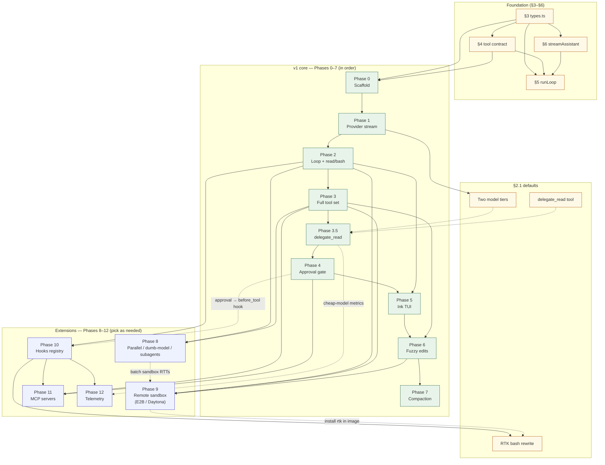

# SPEC: Build a Terminal Coding Agent ("Orin")

A spec + phased build plan for an agentic coding CLI, modeled on three OSS agents that were read from source. Hand this to Claude Code and execute the phases in order. Each phase is independently runnable and testable.

## Reference repos (clone these for study)
- **pi** — `https://github.com/earendil-works/pi` — *primary architectural reference.* Cleanest loop and layering.
- **nanocoder** — `https://github.com/Nano-Collective/nanocoder` — provider-via-AI-SDK, dumb-model support, Ink TUI.
- **opencode** — `https://github.com/anomalyco/opencode` — production patterns: robust edits, compaction, permissions.

> When a phase says "reference X", open that file in the repo and mirror the *approach*, not the code verbatim. These are MIT/OSS but we are writing our own implementation.

---

## 1. Goal & scope

**Goal:** a single-binary TS/Node CLI that, given a prompt, can autonomously read, search, edit, and run code in the current working directory by calling tools in a loop, streaming its work to the terminal, and pausing for approval before dangerous actions.

**In scope — v1 core (Phases 0–7):** the agent loop, ~7 tools, one streaming provider, an approval gate, a basic streaming TUI, reliable file edits, and context compaction. This is a genuinely useful daily-driver agent on its own.

**Defined extensions (Phases 8–12, build as needed):** parallel tool execution, local-model (non–tool-calling) support, remote sandbox execution (E2B/Daytona), hooks/lifecycle interception, MCP server support, and telemetry. These are fully specced later in this doc but are *not* required for v1 — pick them up when you want them. Note they are mostly independent of each other (see each phase's "depends on"). The `delegate_read` cheap-model default (Phase 3.5) ships as part of core, not as an extension.

**Genuinely out of scope (not covered here):** web/desktop/IDE surfaces, multi-provider auth & billing, session sharing/sync, telemetry, and LSP/plan-mode. Subagents are sketched only as a stretch note in Phase 8.

> Earlier drafts listed MCP and subagents as flat "non-goals"; they are now defined extension phases (MCP = Phase 11). The v1/extension split above is the source of truth.

## 2. Tech stack (committed — do not re-litigate)
- **Language/runtime:** TypeScript on Node 20+ (matches pi; simplest toolchain).
- **Package manager:** npm.
- **Provider layer:** **Vercel AI SDK** (`ai` + `@openrouter/ai-sdk-provider`) — OpenRouter for model routing; wrap it behind our own interface so we can swap later (like pi does with its own `pi-ai`).
- **Tool schemas:** Zod → JSON schema (the AI SDK consumes Zod directly).
- **TUI:** start headless with a plain console renderer; add **Ink** (React for the terminal, nanocoder's choice) in Phase 5. *Alternative:* **OpenTUI** (`anomalyco/opentui`, Zig core) if you hit Ink's frame-rate/memory ceiling on heavy streaming — it's what opencode uses. Either way the headless loop makes this a single-subscriber swap.
- **Tests:** vitest.

### 2.1 Sensible defaults
- **Two model tiers in the provider layer.** Configure a **main model** (capable, expensive — e.g. a frontier Anthropic model) and a **cheap model** (fast, low-cost — e.g. a Haiku/Flash-class model). `streamAssistant` (§6) takes a model handle, so this is just two named configs, not two code paths.
- **Delegation tool — `delegate_read` (built-in default).** A tool the main agent calls to hand **read-heavy, low-reasoning work** (scan a large file, summarize logs, search docs, map a directory) to the **cheap model**, so the bulky content and its token cost stay *out* of the main loop's context. It is essentially a constrained subagent: spawn a one-shot sub-loop on the cheap model, give it **read-only tools** (`read`/`grep`/`find`/`ls` — never `write`/`bash`), run the task, and return **only the distilled text** to the main agent. (This generalizes pi's per-turn model swap — `prepareNextTurn` — into an explicit tool the model can invoke on demand.) See Phase 3.5.
  - *Note:* drop in the user's existing implementation here; the interface below is the integration contract, not a rewrite.
- **Command-output compression — RTK (`rtk-ai/rtk`).** A standalone Rust binary ("Rust Token Killer") that filters/compresses the output of common dev commands (`git`, `ls`, `cat`, `grep`, `tsc`, test runners, `docker`, …) before it reaches the model — typically **60–90% fewer tokens** per command, <10ms overhead. It is an external CLI the agent shells out to, not a library. Wire it as a **`before_tool` rewrite hook** (Phase 10): when the `bash` tool is about to run a supported command, rewrite `cmd → rtk <cmd>`. This is exactly the `{ args }` return path the Phase 10 hook already supports, and mirrors how RTK integrates with Claude Code (PreToolUse), opencode (`tool.execute.before`), and pi (extension `tool_call`).
```ts
// before_tool hook — transparently route bash through RTK when available
hooks.on("before_tool", ({ name, args }) => {
  if (name !== "bash" || !rtkInstalled) return;
  const cmd = (args as { command: string }).command.trim();
  if (RTK_SUPPORTED.test(cmd) && !cmd.startsWith("rtk "))
    return { args: { ...args, command: `rtk ${cmd}` } };   // rewrite, don't block
});
```
  - *Scope caveat (from RTK's docs):* the rewrite only helps the **bash** tool. Our dedicated `read`/`grep`/`find` tools bypass it, so to get RTK's compaction there too, have those tools prefer the `rtk read` / `rtk grep` / `rtk find` variants when the binary is present.
  - *Sandbox note:* under Phase 9, install `rtk` in the sandbox image so the rewrite works remotely.
  - *Telemetry tie-in:* RTK tracks its own savings (`rtk gain --format json`); Phase 12 can ingest that as a "tokens saved" metric. Combined with `delegate_read`, you get two complementary token levers — RTK compresses command output inline, `delegate_read` offloads bulky reads to the cheap model.

## 3. Core data model (build this first, in `src/types.ts`)
The whole system is messages of typed content blocks. Mirror pi's `packages/agent/src/types.ts`.

```ts
export type Role = "system" | "user" | "assistant" | "tool";

export type ContentBlock =
  | { type: "text"; text: string }
  | { type: "toolCall"; id: string; name: string; arguments: unknown }
  | { type: "toolResult"; toolCallId: string; output: string; isError?: boolean };

export interface Message { role: Role; content: ContentBlock[]; }

export interface AgentContext {
  messages: Message[];
  cwd: string;
}
```

## 4. Tool contract (in `src/tools/types.ts`)
Every tool is the same shape. Keep the human-facing description in a **separate `.txt` file** loaded at startup — opencode does this (`packages/opencode/src/tool/edit.txt`) and it keeps prompt-tuning out of code.

```ts
export interface Tool<A = unknown> {
  name: string;
  description: string;                // loaded from src/tools/<name>.txt
  schema: z.ZodType<A>;               // -> JSON schema for the model
  needsApproval?: (args: A, ctx: AgentContext) => boolean;
  execute(args: A, ctx: AgentContext, signal: AbortSignal):
    Promise<{ output: string; isError?: boolean; terminate?: boolean }>;
}
```
Reference tool registries: pi `packages/coding-agent/src/core/tools/index.ts`; nanocoder `source/tools/index.ts` (note its static-vs-conditional split — git tools only register if `git` exists).

## 5. The agent loop (in `src/agent/loop.ts`)
This is the heart and it is small. Mirror pi's `runLoop` in `packages/agent/src/agent-loop.ts`. Make the loop **headless**: it takes an `emit(event)` sink and never touches the terminal directly (pi's `AgentEventSink`). The TUI subscribes to events.

```
runLoop(ctx, emit):
  loop:
    message = await streamAssistant(ctx, emit)   // provider call, streamed; appends text + toolCall blocks
    ctx.messages.push(message)
    toolCalls = message.content.filter(c => c.type === "toolCall")
    if toolCalls.empty: break
    results = await executeTools(toolCalls, ctx, emit)   // Phase 8: parallel; v1: sequential
    ctx.messages.push(...results)
    if results.any(r => r.terminate): break
```
Acceptance for the loop layer: it is fully unit-testable by injecting a fake provider (pi ships a `faux` provider in `packages/ai/src/providers/faux.ts` for exactly this — do the same).

## 6. Provider layer (in `src/provider/`)
One function: `streamAssistant(ctx, tools, model, signal) -> AsyncIterable<StreamEvent>` yielding text deltas and assembling tool calls, returning a final assistant `Message`. Back it with the AI SDK's `streamText`. Reference nanocoder `source/ai-sdk-client/chat/streaming-handler.ts` for converting SDK stream parts into our content blocks; reference pi `packages/ai/src/stream.ts` for the event shape.

### Provider registry (issue #12)
The streaming/generation transport is shared; LLM backends plug in behind a `Provider` interface (`src/provider/types.ts`) registered in `src/provider/registry.ts`:

- `Provider` exposes `id` / `displayName`, an `authStrategy` (`api-key` | `oauth`), `isConfigured()`, `normalizeModelId()`, a `languageModel(modelId)` factory returning an AI SDK `LanguageModel`, and a `ModelMetadataProvider` for context-window lookups.
- Core call paths (`stream.ts`, `delegate/delegate-read.ts`, `agent/compaction.ts`) resolve the model via `resolveLanguageModel()` instead of calling `getOpenRouter()` directly. `main.ts` checks `resolveActiveProvider().isConfigured()`.
- The active backend is `loadConfig().provider.active`; resolution falls back to the default (`openrouter`) when the configured id is unknown.
- `/providers` lists and switches the active provider at runtime, persisting `provider.active` to `~/.orin/config.json`. Because models resolve through the registry on each turn, a switch takes effect on the next turn with no rewiring.

**Currently implemented:** OpenRouter (`api-key`), the default. The interface anticipates additional backends (Anthropic/OpenAI API key + OAuth, Regolo, LiteLLM, Vercel/Cloudflare gateways) — each a self-contained module that calls `registerProvider()`. OAuth backends store tokens in `~/.orin/tokens.json` (0600), not the config file.

## 7. Edit tool — the hard part (in `src/tools/edit.ts`)
Build in two stages across phases:
- **v1 (Phase 3): exact-unique match.** Args: `{ edits: [{ oldText, newText }] }`. Each `oldText` must appear exactly once; non-overlapping; applied against the original file; render a unified diff (use the `diff` npm package). Mirror pi `packages/coding-agent/src/core/tools/edit.ts` + `edit-diff.ts`.
- **v2 (Phase 6): fuzzy fallback chain.** When exact match fails, try progressively looser matchers until one resolves. Mirror opencode's replacer chain in `packages/opencode/src/tool/edit.ts`:
  `Simple → LineTrimmed → BlockAnchor → WhitespaceNormalized → IndentationFlexible → EscapeNormalized`, some using Levenshtein distance. This is what makes edits "just work" when the model's quoted text is slightly off.

## 8. Approval gate (in `src/approval/`)
Three modes, toggleable: **normal** (confirm each tool that declares `needsApproval`), **auto-accept** (run without asking), **plan** (model proposes but write/bash are blocked). Reference nanocoder `source/tools/approval-policy.ts` + `needs-approval.ts`, and opencode `packages/opencode/src/permission/`. `bash` and `write`/`edit` default to `needsApproval: true`.

---

## Phased plan (execute in order; each phase ends green)

### Phase dependency graph

Phases 0–7 are the **v1 core path** (execute strictly in order). Phases 8–12 are **extensions** — mostly independent of each other, but each declares its own prerequisites. Solid arrows = hard dependency; dashed arrows = optional / enhances.



**How to read this**

| Phase | Depends on | Notes |
|-------|------------|-------|
| **0** Scaffold | §3 types, §4 tool contract (stubs) | npm, vitest, `.txt` loader |
| **1** Provider | 0 | §6 + `faux` provider; enables §2.1 two-tier models |
| **2** Loop + 2 tools | 1 | §5 headless loop, `read` + `bash` |
| **3** Full tools | 2 | §7 edit v1 (exact match), registry complete |
| **3.5** `delegate_read` | 3, 1 (cheap model config) | §2.1 default; reuses §5 loop on cheap tier |
| **4** Approval | 3.5 (or 3) | §8; tools must exist to gate |
| **5** Ink TUI | 4 (recommended order) | Subscribes to Phase 2 event sink only |
| **6** Fuzzy edits | 5 (recommended order) | §7 v2 replacer chain on top of Phase 3 `edit` |
| **7** Compaction | 6 | Needs a long-running session (loop + messages) |
| **8** Parallel / dumb-model | 2 (+ 3 for full toolset) | Independent of 9–12; parallel exec helps 9 latency |
| **9** Sandbox | 2–6 refactor | Abstract `Workspace`; all fs + exec tools go through it |
| **10** Hooks | 2 | Upgrades event sink; RTK rewrite (§2.1) lives here |
| **11** MCP | 3, 4, 10 | External tools → same §4 registry; untrusted by default |
| **12** Telemetry | 10 | `observe()` only — never blocks the loop |

**Parallelism after v1:** Once Phase 7 is green, extensions can be taken in any order that respects the table — e.g. 10 before 11/12, 9 after tools are workspace-refactored. Phases 8, 9, and 11 do not depend on each other.

---

### Phase 0 — Scaffold
- npm project, TS strict, vitest, `bin` entry, `.txt`-loading helper.
- **Done when:** `npm run dev -- "hello"` prints a stubbed response.

### Phase 1 — Provider stream
- Implement `streamAssistant` over the AI SDK (Anthropic). Add the `faux` provider for tests.
- Ref: nanocoder `ai-sdk-client/chat/streaming-handler.ts`; pi `ai/src/stream.ts`.
- **Done when:** a one-shot prompt streams model text to stdout token-by-token.

### Phase 2 — Bare loop + 2 tools (first real agent)
- Implement `runLoop` headless with an event sink. Tools: `read` and `bash` (bash behind approval).
- Ref: pi `agent/src/agent-loop.ts` (`runLoop`, `executeToolCalls`).
- **Done when:** "what's in package.json and how many deps?" makes the model call `read`, then answer. Loop terminates correctly.

### Phase 3 — Full v1 tool set
- Add `write`, `edit` (exact-unique match), `grep`, `find`/glob, `ls`. Each gets a `.txt` description.
- Ref: pi `coding-agent/src/core/tools/{write,edit,grep,find,ls}.ts`.
- **Done when:** the agent can create a file, edit it, grep for a symbol, and run it — end to end.

### Phase 3.5 — Delegation tool (`delegate_read`, a §2.1 default)
Give the main agent a tool to offload read-heavy work to the cheap model so big content never enters the main context. Depends on: tool registry (§4) and the **two model tiers** (§2.1) in the provider layer.
```ts
// tool: delegate_read  — runs a one-shot sub-loop on the CHEAP model with read-only tools
const delegateRead: Tool<{ task: string; paths?: string[] }> = {
  name: "delegate_read",
  description: "Delegate a read-only investigation (scan/summarize/search) to a cheaper model. " +
               "Returns a distilled answer; the raw file contents do NOT enter your context.",
  schema: z.object({
    task:  z.string().describe("What to find out, in one sentence."),
    paths: z.array(z.string()).optional().describe("Files/globs to focus on."),
  }),
  async execute({ task, paths }, ctx, signal) {
    const sub = makeContext({ cwd: ctx.cwd });                 // fresh context window
    const toolset = pickTools(["read", "grep", "find", "ls"]); // READ-ONLY — no write/bash
    const result = await runLoop(                              // reuse §5 loop, cheap model
      sub, noopSink, { model: models.cheap, tools: toolset, signal,
                       system: `Investigate and report concisely.\nTask: ${task}` +
                               (paths ? `\nFocus: ${paths.join(", ")}` : "") });
    return { output: lastAssistantText(result) };             // only the summary returns
  },
};
```
Wire-in notes: this is the integration point for **the user's existing delegate-to-cheap-model tool** — keep the `Tool` contract and the read-only/cheap-model guarantees, swap the body for their implementation. Register it as a default tool. Because it returns only distilled text, it also *reduces* the need for compaction (Phase 7).
- **Done when:** asking "summarize what `src/server/` does" triggers `delegate_read`, the main transcript shows only the summary (not the file bodies), and token accounting (Phase 12) shows those reads billed to the cheap model.

### Phase 4 — Approval gate + modes
- Wire `needsApproval`, the 3 modes, and a confirm prompt. Abort support via `AbortSignal`.
- Ref: nanocoder `approval-policy.ts`; opencode `permission/`.
- **Done when:** in normal mode, `bash`/`write` pause for y/n; auto-accept runs through; plan blocks writes.

### Phase 5 — TUI (OpenTUI + SolidJS)
- Replace console renderer with a TUI: streaming text, rendered diffs, approval UI. TUI only subscribes to loop events.
- Implemented with **OpenTUI** (`@opentui/core`, Zig-backed renderer) and its **SolidJS** binding (`@opentui/solid`); native scrolling via `<scrollbox>`. Runs on **Bun** (OpenTUI's native FFI requirement); `bun src/cli.ts`.
- **Done when:** edits render as colored diffs and tool calls show inline status.

### Phase 6 — Robust edits (fuzzy replacer chain)
- Add the fallback matchers behind the exact matcher. Unit-test each matcher with deliberately-off inputs.
- Ref: opencode `tool/edit.ts` (the `Replacer` generators + `levenshtein`).
- **Done when:** an edit whose `oldText` differs only in leading whitespace/indentation still applies.

### Phase 7 — Context compaction
- When token count nears the model limit, summarize older turns into a synthetic message and continue.
- Ref: opencode `session/compaction.ts` + `overflow.ts`; pi `coding-agent/src/core/compaction/`.
- **Done when:** a long session keeps working past the raw context window without erroring.

### Phase 8 — Stretch (pick as interest dictates)
- **Parallel tool execution + write serialization:** run independent tool calls concurrently, but funnel file writes through a mutation queue. Ref: pi `executeToolCallsParallel` + `file-mutation-queue.ts`.
- **Dumb-model support:** XML/JSON tool-call fallback parser + self-correction on malformed calls, for local models via Ollama. Ref: nanocoder `source/tool-calling/xml-parser.ts` + the self-correction path in `conversation-loop.tsx`.
- **Subagents, LSP, plan-mode.** Ref: opencode `tool/{task,skill}.ts`, `src/lsp/`. (MCP moved to its own Phase 11.)

### Phase 9 — Remote sandbox execution (Daytona / E2B)
Run the agent's tools inside a cloud sandbox instead of on the local machine. None of the three reference repos ship this, but **pi is architected for it**: its bash tool defines a pluggable `BashOperations.exec` backend with the note *"Override these to delegate command execution to remote systems."* We generalize that idea.

**The key design realization:** swapping only bash is not enough. `read`/`write`/`edit`/`grep`/`find`/`ls` operate on a filesystem too — if bash runs in a sandbox but the file tools read the local disk, the agent edits files the sandbox can't see. So abstract the **whole workspace** (exec + filesystem), not just exec. The sandbox becomes the single source of truth; sync the repo into it at session start.

**9a — Define a `Workspace` backend** (`src/workspace/types.ts`). Generalize pi's `BashOperations`. Every fs tool and the bash tool go through this; local is just one implementation.
```ts
export interface Workspace {
  // exec — mirrors pi's BashOperations.exec (streams via onData, returns exit code)
  exec(command: string, cwd: string, opts: {
    onData: (chunk: Buffer) => void;
    signal?: AbortSignal;
    timeout?: number;            // seconds
    env?: Record<string, string>;
  }): Promise<{ exitCode: number | null }>;

  // filesystem — what read/write/edit/ls/grep/find call instead of node:fs
  readFile(path: string): Promise<string>;
  writeFile(path: string, content: string): Promise<void>;
  list(path: string): Promise<string[]>;

  dispose(): Promise<void>;
}
```
Refactor Phases 2–6 so tools take a `Workspace` from context rather than importing `node:fs`/`child_process` directly. `LocalWorkspace` wraps `node:fs` + `spawn` (lift pi's `createLocalBashOperations` verbatim for `exec`).

**9b — E2B adapter** (`src/workspace/e2b.ts`). Package `e2b`; needs `E2B_API_KEY`. `commands.run` streams natively, which maps cleanly onto `onData`.
```ts
import Sandbox from "e2b";

export async function createE2BWorkspace(): Promise<Workspace> {
  const sbx = await Sandbox.create();                 // ~150ms cold start
  return {
    async exec(command, cwd, { onData, timeout, env }) {
      const r = await sbx.commands.run(command, {
        cwd, envs: env,
        timeoutMs: timeout ? timeout * 1000 : undefined,
        onStdout: (d) => onData(Buffer.from(d)),
        onStderr: (d) => onData(Buffer.from(d)),
      });                                              // resolves on completion
      return { exitCode: r.exitCode };
    },
    readFile: (p) => sbx.files.read(p),
    writeFile: (p, c) => sbx.files.write(p, c).then(() => {}),
    list: async (p) => (await sbx.files.list(p)).map((e) => e.name),
    dispose: () => sbx.kill(),
  };
}
// Abort note: commands.run has no AbortSignal param. For cancellation, run with
// { background: true } to get a handle and call handle.kill() on signal.abort.
```

**9c — Daytona adapter** (`src/workspace/daytona.ts`). Package `@daytonaio/sdk`; needs `DAYTONA_API_KEY`. Note: `executeCommand` **buffers** output (no streaming) — emit once at the end; for live streaming use `process.createSession` + `executeSessionCommand` or the PTY API.
```ts
import { Daytona } from "@daytonaio/sdk";

export async function createDaytonaWorkspace(): Promise<Workspace> {
  const daytona = new Daytona();
  const sbx = await daytona.create({ language: "typescript" });  // ~90ms
  return {
    async exec(command, cwd, { onData, timeout, env }) {
      // signature: executeCommand(command, cwd?, env?, timeout? /* seconds, 0=∞ */)
      const r = await sbx.process.executeCommand(command, cwd, env, timeout ?? 0);
      onData(Buffer.from(r.result ?? ""));            // buffered, not streamed
      return { exitCode: r.exitCode };
    },
    readFile: (p) => sbx.fs.downloadFile(p).then((b) => b.toString("utf8")),
    writeFile: (p, c) => sbx.fs.uploadFile(Buffer.from(c), p),
    list: async (p) => (await sbx.fs.listFiles(p)).map((f) => f.name),
    dispose: () => daytona.delete(sbx),
  };
}
```

**9d — Lifecycle & wiring.**
- Pick the backend from a flag/env (`--sandbox e2b|daytona|local`); construct the `Workspace` at session start, put it on `AgentContext`, and `dispose()` on exit (and on SIGINT).
- **Seed the repo into the sandbox** before the first turn: easiest is `git clone` via one `exec` call, or upload the working tree. Use provider **snapshots** (both support them) to pre-bake dependencies for fast cold starts.

**Gotchas to encode as tests/notes:**
- **`cwd` is not stateful across calls.** Each `exec` is independent, so `cd foo` in one call does not carry to the next — always pass `cwd` per call (pi's interface already does this; preserve it).
- **Latency & cost:** every tool call is now a network round-trip; batch where possible and lean on Phase 8 parallel execution.
- **Streaming parity:** E2B streams; Daytona's `executeCommand` does not — keep the `onData` contract so the TUI is identical regardless of backend, and upgrade Daytona to sessions/PTY later if live output matters.
- **Done when:** with `--sandbox e2b` (and `E2B_API_KEY` set), the agent clones a repo into the sandbox, edits a file, runs its tests, and reports results — with zero commands touching the local machine.

Reference for the seam: pi `packages/coding-agent/src/core/tools/bash.ts` (`BashOperations` + `createLocalBashOperations`).

---

### Phase 10 — Hooks (lifecycle interception)
Hooks are the Phase 2 event sink upgraded twice: handlers are **keyed by event type**, and their **return value can change what the loop does next** (block a tool, rewrite a prompt). pi and opencode both ship this as a programmatic API; Claude Code exposes the same lifecycle points as declarative shell commands. We build the registry, fire it at lifecycle points, and optionally bridge to shell so both authoring styles work.

**10a — Registry** (`src/hooks/types.ts`). Keep pi's distinction between `observe()` (fire-and-forget — literally the event sink) and `on()` (typed handler that may return a result). Per-event result types mirror pi's phantom-typed `HookEvent` (`packages/agent/docs/hooks.md`).
```ts
export interface HookMap {
  before_tool:    { in: { name: string; args: unknown };
                    out: void | { block: true; reason: string } | { args: unknown } };
  after_tool:     { in: { name: string; args: unknown; output: string };
                    out: void | { output: string } };
  before_prompt:  { in: { messages: Message[] };
                    out: void | { messages: Message[] } };
  before_compact: { in: { messages: Message[] };          out: void };
  session_start:  { in: { cwd: string };                  out: void };
  session_end:    { in: { reason: string };               out: void };
}

export interface HookRegistry {
  on<K extends keyof HookMap>(
    event: K,
    handler: (p: HookMap[K]["in"], ctx: AgentContext, signal?: AbortSignal)
      => HookMap[K]["out"] | Promise<HookMap[K]["out"]>,
  ): () => void;                                     // returns unsubscribe (pi-style)
  observe(fn: (e: AgentEvent) => void): () => void;  // == the Phase 2 event sink
}
```

**10b — Fire at lifecycle points.** Wire the registry into the loop (§5) and tool executor:
- `before_tool` — in the executor, *before* `tool.execute`. If any handler returns `{ block, reason }`, skip execution and feed the reason back as the tool result so the model sees the denial and adapts; `{ args }` lets a handler rewrite the call. **First block wins (short-circuit).** = Claude Code `PreToolUse` / pi `tool_call` / opencode `tool.execute.before`. *Canonical `{ args }` rewrite example: the RTK command-compression hook (§2.1).*
- `after_tool` — after execution; a handler may rewrite `output`. = `PostToolUse` / opencode `tool.execute.after`.
- `before_prompt` — in `streamAssistant` (§6) before the provider call; handlers may inject/transform `messages` (e.g. append project conventions). = opencode `chat.messages.transform` / pi `context`.
- `before_compact`, `session_start`, `session_end` — convenience points.

Run handlers in registration order. This is the same machinery as the approval gate (§8) — in fact, reimplement approval as a built-in `before_tool` hook once this exists.

**10c — (optional) Shell-command bridge** for a Claude-Code-style declarative config. Ship one built-in handler that reads a config array of `{ event, command }` and shells out via the Phase 9 `Workspace.exec`. Convention: non-zero exit on `before_tool` ⇒ block with the command's stderr as `reason`; stdout from `before_prompt` ⇒ appended context. Now non-programmers configure hooks in JSON and programmers write TS handlers — both hit the same registry.

Ref: pi `packages/agent/docs/hooks.md` + `examples/extensions/bash-spawn-hook.ts`; opencode `packages/plugin/src` (`tool.execute.before/after`, `permission.ask`, `chat.*.transform`).

**Done when:** a `before_tool` handler that denies `rm -rf` blocks the call and the model receives the denial reason; a `before_prompt` handler injecting a `CONVENTIONS.md` note appears in the model's context on the next turn.

---

### Phase 11 — MCP (external tool servers)
MCP (Model Context Protocol) lets the agent use tools hosted by **external servers** — a database, GitHub, Slack, a search API, your internal services — without baking them in. The agent connects to a server, *discovers* its tools, and merges them into the **same tool registry from §4**, so the loop treats them exactly like native tools. nanocoder and opencode both implement this with the official `@modelcontextprotocol/sdk`; pi deliberately omits it (use CLI tools + skills instead).

**Depends on:** the tool registry (§4 / Phase 3). **Governance:** route every MCP tool call through the approval gate (§8) and the Phase 10 `before_tool` hook — external tools are untrusted by default.

**11a — Config** (`.mcp.json`). An array of servers, each tagged with a transport (mirror nanocoder `.mcp.example.json`):
```jsonc
{ "servers": {
  "fs":     { "type": "stdio", "command": "npx", "args": ["-y", "@modelcontextprotocol/server-filesystem", "."] },
  "github": { "type": "http",  "url": "https://mcp.example.com/github" }
}}
```

**11b — Client + transport factory** (`src/mcp/client.ts`). Three transports, exactly as nanocoder's `transport-factory.ts` imports them:
```ts
import { Client } from "@modelcontextprotocol/sdk/client/index.js";
import { StdioClientTransport } from "@modelcontextprotocol/sdk/client/stdio.js";
import { StreamableHTTPClientTransport } from "@modelcontextprotocol/sdk/client/streamableHttp.js";
import { WebSocketClientTransport } from "@modelcontextprotocol/sdk/client/websocket.js";

function makeTransport(s: McpServerConfig) {
  switch (s.type) {
    case "stdio": return new StdioClientTransport({ command: s.command, args: s.args, env: s.env });
    case "http":  return new StreamableHTTPClientTransport(new URL(s.url));
    case "ws":    return new WebSocketClientTransport(new URL(s.url));
  }
}

export async function connectServer(s: McpServerConfig) {
  const client = new Client({ name: "orin", version: "0.1.0" });
  await client.connect(makeTransport(s));
  const { tools } = await client.listTools();      // discover remote tools
  return { client, tools };
}
```

**11c — Adapt discovered tools into the registry** (`src/mcp/adapter.ts`). Wrap each remote tool as one of our `Tool`s (§4) whose `execute` calls `client.callTool`. **Namespace** the name (`<server>__<tool>`) to avoid collisions; the remote `inputSchema` (JSON Schema) becomes the tool's schema. This is nanocoder's `mcp-client.ts` pattern (its `execute: async (input) => callTool(...)` wrapper).
```ts
function toLocalTool(client, server: string, t): Tool {
  return {
    name: `${server}__${t.name}`,
    description: t.description ?? "",
    schema: jsonSchemaToZod(t.inputSchema),         // or hand the JSON Schema to the model directly
    needsApproval: () => true,                       // external ⇒ untrusted
    async execute(args) {
      const res = await client.callTool({ name: t.name, arguments: args });
      return { output: renderMcpContent(res.content) };  // MCP returns content blocks
    },
  };
}
```

**11d — Lifecycle.** Connect all servers **in parallel at startup with `Promise.allSettled`** (one bad server must not crash the agent — nanocoder's batch-connect tolerates failures), merge their tools into the registry alongside native tools, and close clients on exit. Log and skip servers that fail to connect.

Ref: nanocoder `source/mcp/{transport-factory,mcp-client}.ts` + `source/config/mcp-config-loader.ts` + `.mcp.example.json`; opencode `packages/opencode/src/mcp/`.

**Done when:** with the filesystem server in `.mcp.json`, the agent lists/reads files via the `fs__*` MCP tools, each call passes through the approval gate, and a deliberately-broken server entry logs a warning without taking down the session.

---

### Phase 12 — Telemetry (on the hook observer channel)
Your instinct is right: telemetry is **pure observation**, so it rides the `observe()` side of the Phase 10 hook registry and **never** uses `on()` handlers. Why that distinction matters: an observer that throws or stalls must not be able to veto or delay the agent — keeping telemetry fire-and-forget guarantees a metrics bug can't break the loop. (Requires that the registry surfaces each lifecycle point to observers too, not only to handlers.)

**Capture (metadata only — never prompt or file content by default):**
- **per turn:** model, input/output/cache tokens and cost — read straight off `AssistantMessage.usage`. Mirror pi's `Usage` (`packages/ai/src/types.ts`): `{ input, output, cacheRead, cacheWrite, totalTokens, cost: {…, total} }`. Plus `stopReason`.
- **per tool:** name, duration (pair the `before_tool`/`after_tool` events), ok/error, output size.
- **per session:** turn count, total tokens/cost, wall-clock, and **model mix** — including the cheap-model share driven by `delegate_read` (§2.1), so you can see delegation paying off.

**Emitter + exporters** (`src/telemetry/`): a `MetricEvent` union into pluggable sinks. Default = JSONL at `~/.orin/metrics.jsonl`; optional stdout; optional OTel/HTTP later.
```ts
type MetricEvent =
  | { kind: "turn";    model: string; usage: Usage; stopReason: string }
  | { kind: "tool";    name: string; ms: number; ok: boolean; bytes: number }
  | { kind: "session"; turns: number; costUsd: number; ms: number };

interface MetricSink { emit(e: MetricEvent): void; flush?(): Promise<void>; }

export function installTelemetry(hooks: HookRegistry, sinks: MetricSink[]) {
  if (telemetryDisabled()) return;                       // opt-out via env flag
  const startedAt = new Map<string, number>();
  hooks.observe((e) => {                                 // observers only — return nothing
    switch (e.type) {
      case "before_tool": startedAt.set(e.name, Date.now()); break;
      case "after_tool":  send(sinks, { kind: "tool", name: e.name, ok: !e.isError,
                             ms: Date.now() - (startedAt.get(e.name) ?? Date.now()),
                             bytes: e.output.length }); break;
      case "assistant_message": send(sinks, { kind: "turn", model: e.message.model,
                             usage: e.message.usage, stopReason: e.message.stopReason }); break;
    }
  });
}
```

**Privacy:** off-by-default or opt-out via an env flag; emit counts/IDs, not content. Mirror pi's `core/telemetry.ts` (`isInstallTelemetryEnabled`, truthy-env-flag check).

Ref: pi `packages/coding-agent/src/core/telemetry.ts` + `packages/ai/src/types.ts` (`Usage`).

**Done when:** a session writes one `turn` event per assistant message with real token/cost numbers, `tool` events with durations, and a `session` summary on exit — and setting the opt-out env var produces zero events.

---

## Testing strategy
- Inject the `faux` provider to drive the loop deterministically (assert tool calls happen in expected order, loop terminates, malformed calls self-correct).
- Golden-file tests for each edit matcher.
- Run tool handlers against a temp dir fixture.

## File/module map to create
```
src/
  types.ts                 # message + content-block model (§3)
  provider/stream.ts       # streamAssistant over AI SDK (§6)
  provider/faux.ts         # test provider
  agent/loop.ts            # runLoop, executeTools (§5)
  agent/events.ts          # AgentEvent + sink type
  tools/types.ts           # Tool contract (§4)
  tools/{read,write,edit,bash,grep,find,ls}.ts
  tools/delegate-read.ts   # §2.1 cheap-model delegation (Phase 3.5)
  tools/{...}.txt          # descriptions, loaded at startup
  tools/registry.ts        # static + conditional registration
  approval/policy.ts       # modes + needsApproval (§8)
  edit/replacers.ts        # Phase 6 fuzzy chain
  session/compaction.ts    # Phase 7
  workspace/types.ts       # Workspace backend (exec + fs), Phase 9
  workspace/{local,e2b,daytona}.ts  # Phase 9 backends
  hooks/types.ts           # HookRegistry: on() handlers + observe() (Phase 10)
  hooks/registry.ts        # fires before_tool / after_tool / before_prompt
  mcp/client.ts            # connect + transport factory (Phase 11)
  mcp/adapter.ts           # wrap remote tools into the §4 registry
  telemetry/sinks.ts       # MetricEvent + JSONL/stdout/OTel sinks (Phase 12)
  telemetry/install.ts     # observe() subscriptions on the hook registry
  hooks/rtk-rewrite.ts     # before_tool hook: bash cmd -> `rtk cmd` (§2.1)
  tui/                      # Phase 5 (OpenTUI + SolidJS, runs on Bun — see §2)
  cli.ts                    # arg parse, mode flags, entrypoint
```

## The one thing to remember
A working agent is ~300 lines: the loop + 5 tools + one streaming provider. Everything after Phase 3 is reliability and polish, added one phase at a time — and you can read exactly how each reference repo did it.
